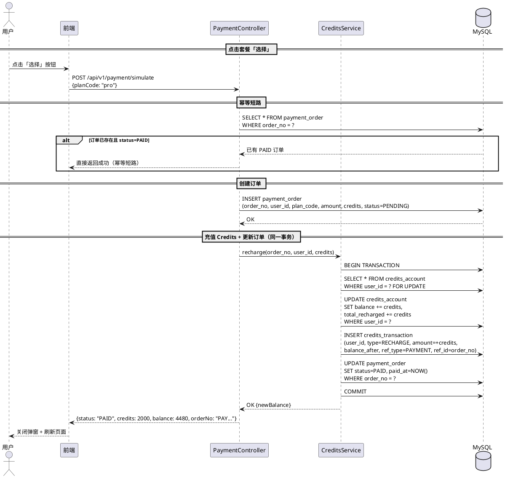
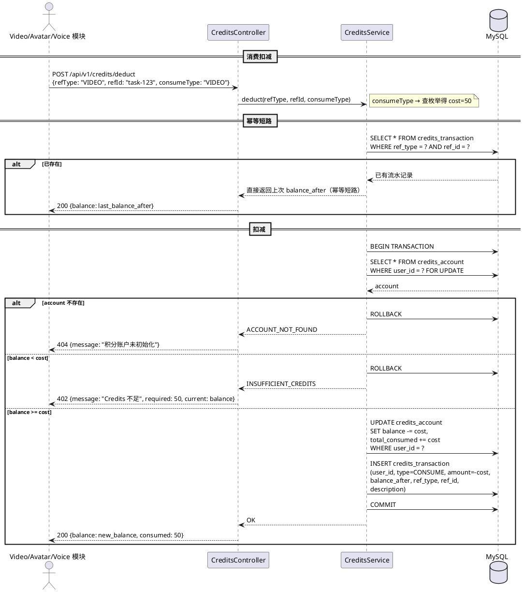
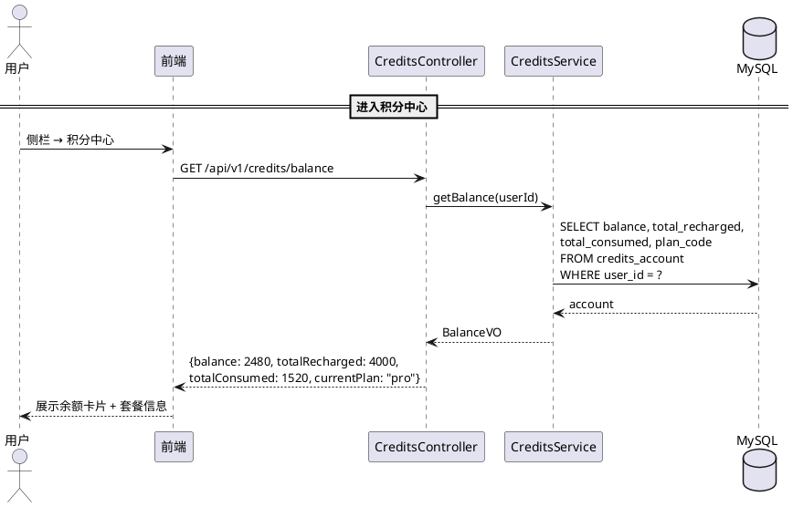
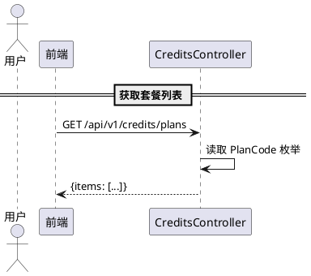
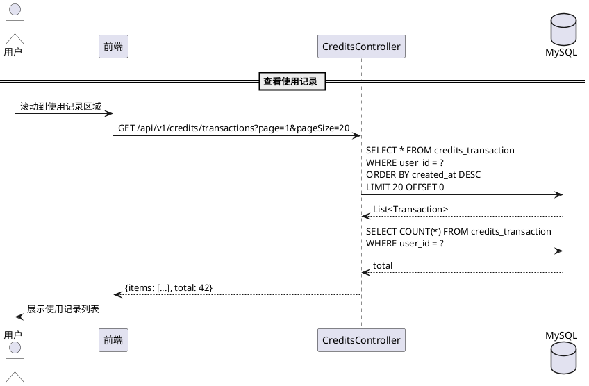
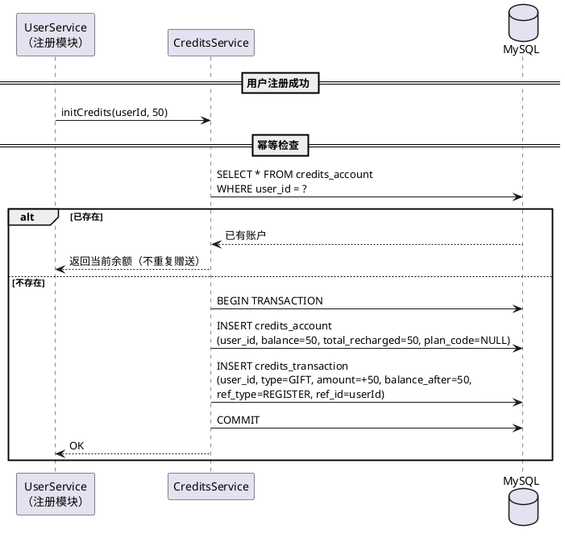

# 技术设计文档

> **迭代**：2026-06-19_积分体系_v1.0
> **版本**：v1.1（Review 修订版）
> **最后更新**：2026-06-19

---

## 1. 概览

### 1.1 核心链路一图看

```
┌─────────┐    模拟充值     ┌───────────────┐     INSERT      ┌─────────────────┐
│  前端    │ ─────────────▶ │ farvis-payment │ ──────────────▶ │ payment_order   │
│         │                └───────┬───────┘                 └─────────────────┘
└─────────┘                        │
                                   │ 充值 Credits
                                   ▼
                          ┌────────────────┐   UPDATE     ┌─────────────────┐
                          │ farvis-credits  │ ──────────▶ │ credits_account │
                          │                │   INSERT     ├─────────────────┤
                          │                │ ──────────▶ │credits_transaction│
                          └───────┬────────┘              └─────────────────┘
                                  │
              被调用：扣减余额      │
         ┌────────────────────────┼────────────────────┐
         │                        │                    │
    ┌────▼─────┐           ┌─────▼──────┐       ┌─────▼──────┐
    │  video   │           │  avatar    │       │   voice    │
    │ (50C/次) │           │ (100C/次)  │       │  (50C/次)  │
    └──────────┘           └────────────┘       └────────────┘
```

### 1.2 接口速览表

| 模块 | 方法 | 路径 | 说明 |
|------|------|------|------|
| farvis-credits | GET | /api/v1/credits/balance | 查询当前余额 |
| farvis-credits | POST | /api/v1/credits/deduct | 消费扣减（供 video/avatar/voice 调用） |
| farvis-credits | GET | /api/v1/credits/transactions | 消费记录分页查询 |
| farvis-credits | GET | /api/v1/credits/plans | 套餐列表查询 |
| farvis-payment | POST | /api/v1/payment/simulate | 模拟支付（演示版） |
| farvis-credits | POST | /api/v1/credits/init | 新用户注册赠送（内部调用） |

> **user_id 来源**：所有面向前端的接口，user_id 从 JWT token 解析，不由前端传入。

### 1.3 表结构速览表

| 表名 | 中文 | 核心字段 | 本迭代新增 |
|------|------|---------|:--------:|
| credits_account | 积分账户表 | user_id, balance, total_recharged, total_consumed | ✅ |
| credits_transaction | 积分流水表 | user_id, type, amount, balance_after, ref_type, ref_id | ✅ |
| payment_order | 支付订单表 | user_id, plan_code, amount, credits, status | ✅ |

### 1.4 Redis 说明

> **演示版暂不使用 Redis。** 正式版用途：(a) 余额缓存（TTL 5s）(b) 幂等去重（SET NX + TTL）(c) 接口限流。

---

## 2. 数据模型

### 2.1 ER 关系图

```
┌──────────────┐ 1       1 ┌─────────────────┐
│     User     │───────────│ credits_account │
└──────────────┘           └────────┬────────┘
                                    │ 1
                                    │
                                    │ N
                           ┌────────▼────────────────┐
                           │  credits_transaction    │
                           └─────────────────────────┘

┌──────────────┐ 1       N ┌─────────────────┐
│     User     │───────────│  payment_order  │
└──────────────┘           └─────────────────┘
```

### 2.2 DDL

```sql
-- 积分账户表（每用户一条，存当前余额快照）
CREATE TABLE credits_account (
    id              BIGINT PRIMARY KEY AUTO_INCREMENT COMMENT '主键',
    user_id         BIGINT NOT NULL COMMENT '用户 ID',
    balance         INT NOT NULL DEFAULT 0 COMMENT '当前余额（Credits）',
    total_recharged INT NOT NULL DEFAULT 0 COMMENT '累计充值（Credits）',
    total_consumed  INT NOT NULL DEFAULT 0 COMMENT '累计消费（Credits）',
    plan_code       VARCHAR(32) DEFAULT NULL COMMENT '当前套餐编码（starter/pro/enterprise）',
    created_at      DATETIME NOT NULL DEFAULT CURRENT_TIMESTAMP,
    updated_at      DATETIME NOT NULL DEFAULT CURRENT_TIMESTAMP ON UPDATE CURRENT_TIMESTAMP,
    UNIQUE KEY uk_user_id (user_id),
    CONSTRAINT chk_balance CHECK (balance >= 0),
    CONSTRAINT chk_recharged CHECK (total_recharged >= 0),
    CONSTRAINT chk_consumed CHECK (total_consumed >= 0)
) COMMENT='积分账户表';

-- 积分流水表（每次变动一条，只追加不修改）
CREATE TABLE credits_transaction (
    id              BIGINT PRIMARY KEY AUTO_INCREMENT COMMENT '主键',
    user_id         BIGINT NOT NULL COMMENT '用户 ID',
    type            VARCHAR(32) NOT NULL COMMENT '变动类型：RECHARGE/CONSUME/GIFT',
    amount          INT NOT NULL COMMENT '变动数量（正数=充值/赠送，负数=消费）',
    balance_after   INT NOT NULL COMMENT '变动后余额',
    ref_type        VARCHAR(32) DEFAULT NULL COMMENT '关联业务类型：VIDEO/AVATAR/VOICE/PAYMENT/REGISTER',
    ref_id          VARCHAR(64) DEFAULT NULL COMMENT '关联业务 ID（订单号/视频ID 等）',
    description     VARCHAR(256) DEFAULT NULL COMMENT '描述（展示用）',
    created_at      DATETIME NOT NULL DEFAULT CURRENT_TIMESTAMP,
    INDEX idx_user_id_created (user_id, created_at),
    UNIQUE KEY uk_ref (ref_type, ref_id)
) COMMENT='积分流水表';

-- 支付订单表（演示版也用，为正式版预留结构）
CREATE TABLE payment_order (
    id              BIGINT PRIMARY KEY AUTO_INCREMENT COMMENT '主键',
    order_no        VARCHAR(64) NOT NULL COMMENT '订单号（PAY+yyyyMMddHHmmss+4位随机）',
    user_id         BIGINT NOT NULL COMMENT '用户 ID',
    plan_code       VARCHAR(32) NOT NULL COMMENT '套餐编码：starter/pro/enterprise',
    amount          DECIMAL(10,2) NOT NULL COMMENT '支付金额（元）',
    credits         INT NOT NULL COMMENT '充值 Credits 数量',
    status          VARCHAR(16) NOT NULL DEFAULT 'PENDING' COMMENT '状态：PENDING/PAID/CANCELLED/FAILED',
    paid_at         DATETIME DEFAULT NULL COMMENT '支付完成时间',
    created_at      DATETIME NOT NULL DEFAULT CURRENT_TIMESTAMP,
    updated_at      DATETIME NOT NULL DEFAULT CURRENT_TIMESTAMP ON UPDATE CURRENT_TIMESTAMP,
    UNIQUE KEY uk_order_no (order_no),
    INDEX idx_user_id_status (user_id, status),
    CONSTRAINT chk_status CHECK (status IN ('PENDING','PAID','CANCELLED','FAILED'))
) COMMENT='支付订单表';
```

### 2.3 消费价格配置（枚举类）

```
// 消费类型与 Credits 映射（Java 枚举）
ConsumeType:
  VIDEO     → 50 Credits
  AVATAR    → 100 Credits
  VOICE     → 50 Credits
```

> deduct 接口入参传 `consumeType`（非金额），服务内部根据枚举查价格。调价时只改枚举，调用方无需变动。

### 2.4 套餐配置（枚举类）

```
// 套餐配置（Java 枚举）
PlanCode:
  starter    → ¥99/月,  500 Credits,  "入门版"
  pro        → ¥299/月, 2000 Credits, "专业版"
  enterprise → ¥999/月, 10000 Credits,"企业版"
```

> GET /api/v1/credits/plans 接口从此枚举读取，不建独立表（演示版够用，正式版可改数据库配置）。

### 2.5 状态枚举定义

**credits_transaction.type（变动类型）**

| 枚举值 | 中文 | 说明 |
|--------|------|------|
| RECHARGE | 充值 | 模拟支付成功后写入 |
| CONSUME | 消费 | video/avatar/voice 扣减 |
| GIFT | 赠送 | 新用户注册赠送 |

**payment_order.status（订单状态）**

| 枚举值 | 中文 | 说明 |
|--------|------|------|
| PENDING | 待支付 | 创建订单后初始状态 |
| PAID | 已支付 | 模拟支付成功 |
| CANCELLED | 已取消 | 用户取消 |
| FAILED | 失败 | 充值过程异常 |

### 2.6 设计约定

| 约定 | 说明 |
|------|------|
| 余额快照 | `credits_account.balance` 存当前余额快照，`balance = total_recharged - total_consumed` 可验证 |
| 流水只追加 | `credits_transaction` 只 INSERT，不 UPDATE/DELETE |
| Credits 用 INT | Credits 为整数，用 INT 存 |
| 金额用 DECIMAL | 支付金额（元）用 DECIMAL(10,2) |
| 订单号格式 | `PAY` + yyyyMMddHHmmss + 4 位随机数 |
| 幂等键 | `credits_transaction` 的 `(ref_type, ref_id)` 唯一索引保证幂等 |
| DB 兜底 | CHECK 约束防余额/累计为负 |

---

## 3. 核心流程

### 3.1 模拟充值流程



**操作矩阵**

| 步骤 | 操作 | 校验 | INSERT | UPDATE | 事务 | 锁 |
|:----:|------|------|--------|--------|:----:|:--:|
| 1 | 幂等短路 | 订单号已存在且 PAID | - | - | - | - |
| 2 | 创建订单 | 套餐编码有效性 | payment_order（全字段） | - | ⚠️ 同一事务 | - |
| 3 | 充值 + 更新订单 | - | credits_transaction（全字段） | credits_account（balance, total_recharged）+ payment_order（status, paid_at） | ⚠️ 同一事务 | SELECT FOR UPDATE |

> ⚠️ **步骤 2+3 合并为同一事务**（Review C2 修复）：避免余额到账但订单状态不一致的断点。充值失败时整体 ROLLBACK，订单保持 PENDING → 前端可重试。

> ⚠️ **total_recharged 同步更新**（Review C3 修复）：充值时 `total_recharged += credits`。

### 3.2 消费扣减流程



**操作矩阵**

| 步骤 | 操作 | 校验 | INSERT | UPDATE | 事务 | 锁 |
|:----:|------|------|--------|--------|:----:|:--:|
| 0 | 幂等短路 | uk_ref 已存在 | - | - | - | - |
| 1 | 查询账户 | account 是否存在 | - | - | ⚠️ 同一事务 | SELECT FOR UPDATE |
| 2 | 校验余额 | balance >= cost | - | - | - | 行锁已持有 |
| 3a | 扣减 + 写流水 | 步骤 2 通过 | credits_transaction（全字段） | credits_account（balance, total_consumed） | ⚠️ 同一事务 | 行锁 |
| 3b | 账户不存在 | account 为 null | - | - | ROLLBACK | 释放 |
| 3c | 余额不足 | balance < cost | - | - | ROLLBACK | 释放 |

> ⚠️ **uk_ref 唯一索引兜底幂等**（Review C1 修复）：即使并发请求都通过了步骤 0 的检查，INSERT 时唯一索引会拒绝第二条，避免双扣。

> ⚠️ **total_consumed 同步更新**（Review C3 修复）：扣减时 `total_consumed += cost`。

> ⚠️ **consumeType 替代 amount**（Review M1 修复）：调用方传业务类型，credits 服务内部查枚举得金额。

### 3.3 余额查询流程



**响应体定义**

```json
{
    "balance": 2480,
    "totalRecharged": 4000,
    "totalConsumed": 1520,
    "currentPlan": "pro"
}
```

### 3.4 套餐列表查询



**响应体定义**

```json
{
    "items": [
        {"code": "starter", "name": "入门版", "price": 99, "credits": 500, "highlighted": false},
        {"code": "pro", "name": "专业版", "price": 299, "credits": 2000, "highlighted": true},
        {"code": "enterprise", "name": "企业版", "price": 999, "credits": 10000, "highlighted": false}
    ]
}
```

### 3.5 消费记录查询流程



**响应体定义**

```json
{
    "total": 42,
    "items": [
        {"type": "CONSUME", "amount": -50, "balanceAfter": 2430, "description": "视频生成", "createdAt": "2026-06-19T14:30:00"},
        {"type": "RECHARGE", "amount": 2000, "balanceAfter": 2480, "description": "专业版月度充值", "createdAt": "2026-06-01T00:00:00"}
    ]
}
```

> 分页参数：默认 pageSize=20，最大 100。

### 3.6 新用户注册赠送流程



**操作矩阵**

| 步骤 | 操作 | INSERT | UPDATE | 事务 | 幂等 |
|:----:|------|--------|--------|:----:|:----:|
| 0 | 检查是否已存在 | - | - | - | 已存在则直接返回 |
| 1 | 创建账户 + 写流水 | credits_account + credits_transaction | - | ⚠️ 同一事务 | DuplicateKey 兜底 |

> ⚠️ **幂等保护**（Review C5 修复）：先 SELECT 检查，已存在则直接返回。INSERT 时 `uk_user_id` 唯一键做最后一道防线。

---

## 4. 模块边界与接口设计

### 4.1 接口详细定义

#### POST /api/v1/credits/deduct

| 项 | 值 |
|---|---|
| 调用方 | video / avatar / voice |
| 请求体 | `{ "refType": "VIDEO", "refId": "task-123", "consumeType": "VIDEO" }` |
| 成功响应 | `200 { "balance": 450, "consumed": 50 }` |
| 余额不足 | `402 { "error": "INSUFFICIENT_BALANCE", "currentBalance": 30, "required": 50 }` |
| 账户不存在 | `404 { "error": "ACCOUNT_NOT_FOUND" }` |

#### POST /api/v1/payment/simulate

| 项 | 值 |
|---|---|
| 调用方 | 前端 |
| 请求体 | `{ "planCode": "pro" }` |
| 成功响应 | `200 { "orderNo": "PAY20260619...", "status": "PAID", "creditsAdded": 2000, "newBalance": 4480 }` |

#### GET /api/v1/credits/balance

| 项 | 值 |
|---|---|
| 调用方 | 前端 |
| 响应 | `{ "balance": 2480, "totalRecharged": 4000, "totalConsumed": 1520, "currentPlan": "pro" }` |

#### GET /api/v1/credits/plans

| 项 | 值 |
|---|---|
| 调用方 | 前端 |
| 响应 | `{ "items": [{ "code", "name", "price", "credits", "highlighted" }] }` |

#### GET /api/v1/credits/transactions

| 项 | 值 |
|---|---|
| 调用方 | 前端 |
| 参数 | `page`（默认1）, `pageSize`（默认20，最大100） |
| 响应 | `{ "total": int, "items": [{ "type", "amount", "balanceAfter", "description", "createdAt" }] }` |

#### POST /api/v1/credits/init

| 项 | 值 |
|---|---|
| 调用方 | UserService（内部） |
| 请求体 | `{ "userId": long, "giftCredits": 50 }` |
| 响应 | `200 { "balance": 50 }` |

### 4.2 模块间调用约定

| 约定 | 说明 |
|------|------|
| 同步调用 | 演示版所有模块间调用均为同步 HTTP，不走 MQ |
| 幂等要求 | deduct 和 init 接口均幂等（重复调用不重复操作） |
| HTTP 超时 | 模块间调用超时 3s，失败不重试（演示版） |
| 错误码 | 402=余额不足，404=账户不存在，500=系统异常 |

---

## 5. 关键风险与应对

### 5.1 可应对风险

| 风险 | 概率 | 影响 | 应对方案 |
|------|:----:|------|---------|
| 并发扣减导致余额为负 | 低 | 中 | SELECT FOR UPDATE 行锁 + CHECK 约束兜底 |
| 幂等被绕过 | 低 | 高 | uk_ref 唯一索引做最终防线 |
| 余额与流水 SUM 不一致 | 低 | 高 | 同一事务 + CHECK 约束；正式版加定时对账任务 |

### 5.2 已知不可规避风险（演示版局限）

| 风险 | 场景 | 后果 | 根因 |
|------|------|------|------|
| 无真实支付对账 | 正式版接入支付宝/微信 | 渠道侧与内部余额可能不一致 | 演示版无支付渠道 |
| 无并发压测 | 多用户同时操作 | 行锁可能成瓶颈 | 演示版单线程模拟 |
| 无套餐到期处理 | 正式版套餐到期 | 用户状态/余额处理未定义 | 演示版套餐无有效期 |
| 无分布式事务 | 正式版 credits 独立部署 | 跨服务扣减需要 TCC/Saga | 演示版单体应用 |

---

## 6. 任务拆解建议

| 切片 | 内容 | 预估 |
|:----:|------|------|
| S1 | DDL 建表 + Entity/Repository + 枚举类（ConsumeType, PlanCode） | 0.5h |
| S2 | CreditsService（init/recharge/deduct/getBalance）含幂等逻辑 | 1.5h |
| S3 | PaymentController + simulate 接口（含事务合并） | 0.5h |
| S4 | CreditsController（balance/plans/transactions/deduct 接口） | 0.5h |
| S5 | 前端积分中心页面（余额卡片 + 套餐 + 记录） | 1h |
| S6 | 模拟支付弹窗 | 0.5h |
| S7 | 集成测试（注册→赠送→充值→消费→查记录→幂等验证） | 0.5h |
