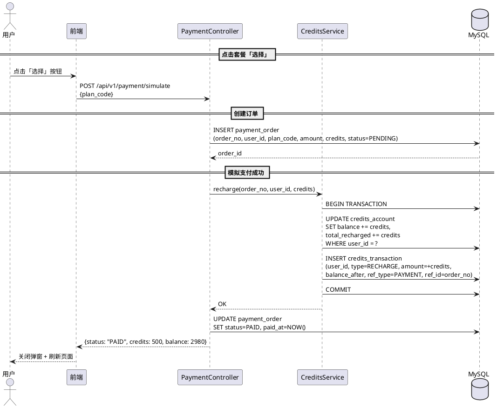
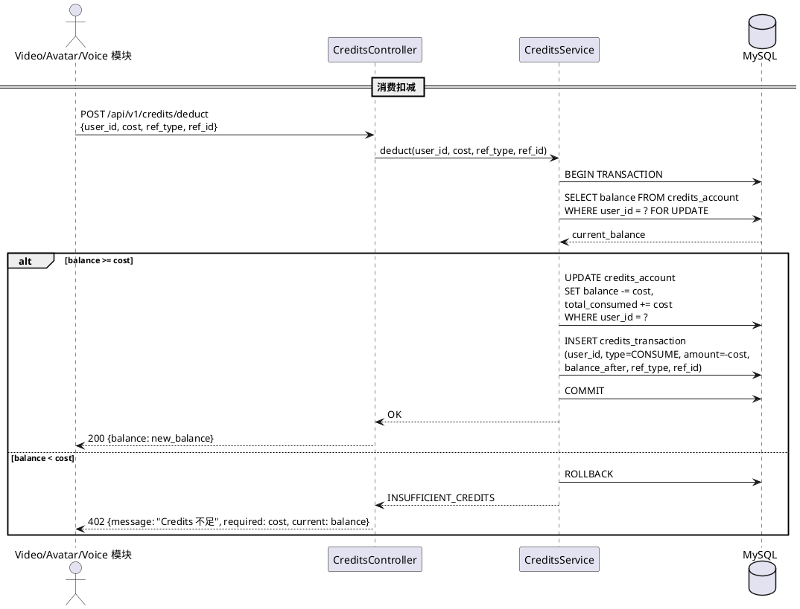
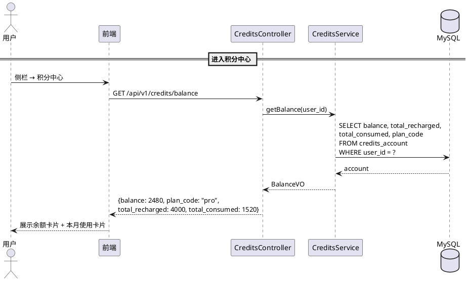
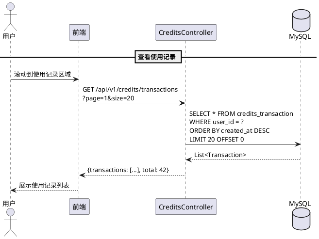
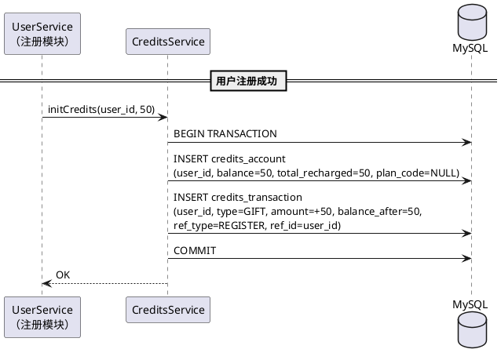

# 技术设计文档

> **迭代**：2026-06-19_积分体系_v1.0
> **版本**：v1.0 内部演示版
> **最后更新**：2026-06-19

---

## 1. 概览

### 1.1 核心链路一图看

```
┌─────────┐    模拟充值     ┌───────────────┐     INSERT      ┌─────────────────┐
│  前端    │ ─────────────▶ │ farvis-payment │ ──────────────▶ │ payment_order   │
│         │                └───────┬───────┘                 └─────────────────┘
└─────────┘                        │
                                   │ 充值 Credits
                                   ▼
                          ┌────────────────┐   UPDATE     ┌─────────────────┐
                          │ farvis-credits  │ ──────────▶ │ credits_account │
                          │                │   INSERT     ├─────────────────┤
                          │                │ ──────────▶ │credits_transaction│
                          └───────┬────────┘              └─────────────────┘
                                  │
              被调用：扣减余额      │
         ┌────────────────────────┼────────────────────┐
         │                        │                    │
    ┌────▼─────┐           ┌─────▼──────┐       ┌─────▼──────┐
    │  video   │           │  avatar    │       │   voice    │
    │ (50C/次) │           │ (100C/次)  │       │  (50C/次)  │
    └──────────┘           └────────────┘       └────────────┘
```

### 1.2 接口速览表

| 模块 | 方法 | 路径 | 说明 |
|------|------|------|------|
| farvis-credits | GET | /api/v1/credits/balance | 查询当前余额 |
| farvis-credits | POST | /api/v1/credits/deduct | 消费扣减（供 video/avatar/voice 调用） |
| farvis-credits | GET | /api/v1/credits/transactions | 消费记录查询 |
| farvis-payment | POST | /api/v1/payment/simulate | 模拟支付（演示版） |
| farvis-credits | POST | /api/v1/credits/init | 新用户注册赠送（内部调用） |

### 1.3 表结构速览表

| 表名 | 中文 | 核心字段 | 本迭代新增 |
|------|------|---------|:--------:|
| credits_account | 积分账户表 | user_id, balance, total_recharged, total_consumed | ✅ |
| credits_transaction | 积分流水表 | user_id, type, amount, balance_after, ref_type, ref_id | ✅ |
| payment_order | 支付订单表 | user_id, plan_code, amount, credits, status | ✅ |

---

## 2. 数据模型

### 2.1 ER 关系图

```
┌──────────────┐ 1       1 ┌─────────────────┐
│     User     │───────────│ credits_account │
└──────────────┘           └────────┬────────┘
                                    │ 1
                                    │
                                    │ N
                           ┌────────▼────────────────┐
                           │  credits_transaction    │
                           └─────────────────────────┘

┌──────────────┐ 1       N ┌─────────────────┐
│     User     │───────────│  payment_order  │
└──────────────┘           └─────────────────┘
```

### 2.2 DDL

```sql
-- 积分账户表（每用户一条，存当前余额快照）
CREATE TABLE credits_account (
    id              BIGINT PRIMARY KEY AUTO_INCREMENT COMMENT '主键',
    user_id         BIGINT NOT NULL COMMENT '用户 ID',
    balance         INT NOT NULL DEFAULT 0 COMMENT '当前余额（Credits）',
    total_recharged INT NOT NULL DEFAULT 0 COMMENT '累计充值（Credits）',
    total_consumed  INT NOT NULL DEFAULT 0 COMMENT '累计消费（Credits）',
    plan_code       VARCHAR(32) DEFAULT NULL COMMENT '当前套餐编码（starter/pro/enterprise）',
    created_at      DATETIME NOT NULL DEFAULT CURRENT_TIMESTAMP,
    updated_at      DATETIME NOT NULL DEFAULT CURRENT_TIMESTAMP ON UPDATE CURRENT_TIMESTAMP,
    UNIQUE KEY uk_user_id (user_id)
) COMMENT='积分账户表';

-- 积分流水表（每次变动一条，只追加不修改）
CREATE TABLE credits_transaction (
    id              BIGINT PRIMARY KEY AUTO_INCREMENT COMMENT '主键',
    user_id         BIGINT NOT NULL COMMENT '用户 ID',
    type            VARCHAR(32) NOT NULL COMMENT '变动类型：RECHARGE/CONSUME/GIFT',
    amount          INT NOT NULL COMMENT '变动数量（正数=充值/赠送，负数=消费）',
    balance_after   INT NOT NULL COMMENT '变动后余额',
    ref_type        VARCHAR(32) DEFAULT NULL COMMENT '关联业务类型：VIDEO/AVATAR/VOICE/PAYMENT/REGISTER',
    ref_id          VARCHAR(64) DEFAULT NULL COMMENT '关联业务 ID（订单号/视频ID 等）',
    description     VARCHAR(256) DEFAULT NULL COMMENT '描述（展示用）',
    created_at      DATETIME NOT NULL DEFAULT CURRENT_TIMESTAMP,
    INDEX idx_user_id_created (user_id, created_at)
) COMMENT='积分流水表';

-- 支付订单表（演示版也用，为正式版预留结构）
CREATE TABLE payment_order (
    id              BIGINT PRIMARY KEY AUTO_INCREMENT COMMENT '主键',
    order_no        VARCHAR(64) NOT NULL COMMENT '订单号（业务生成，唯一）',
    user_id         BIGINT NOT NULL COMMENT '用户 ID',
    plan_code       VARCHAR(32) NOT NULL COMMENT '套餐编码：starter/pro/enterprise',
    amount          DECIMAL(10,2) NOT NULL COMMENT '支付金额（元）',
    credits         INT NOT NULL COMMENT '充值 Credits 数量',
    status          VARCHAR(16) NOT NULL DEFAULT 'PENDING' COMMENT '状态：PENDING/PAID/CANCELLED',
    paid_at         DATETIME DEFAULT NULL COMMENT '支付完成时间',
    created_at      DATETIME NOT NULL DEFAULT CURRENT_TIMESTAMP,
    updated_at      DATETIME NOT NULL DEFAULT CURRENT_TIMESTAMP ON UPDATE CURRENT_TIMESTAMP,
    UNIQUE KEY uk_order_no (order_no),
    INDEX idx_user_id_status (user_id, status)
) COMMENT='支付订单表';
```

### 2.3 状态枚举定义

**credits_transaction.type（变动类型）**

| 枚举值 | 中文 | 说明 |
|--------|------|------|
| RECHARGE | 充值 | 模拟支付成功后写入 |
| CONSUME | 消费 | video/avatar/voice 扣减 |
| GIFT | 赠送 | 新用户注册赠送 |

**payment_order.status（订单状态）**

| 枚举值 | 中文 | 说明 |
|--------|------|------|
| PENDING | 待支付 | 创建订单后初始状态 |
| PAID | 已支付 | 模拟支付成功 |
| CANCELLED | 已取消 | 用户取消 |

### 2.4 设计约定

| 约定 | 说明 |
|------|------|
| 余额快照 | `credits_account.balance` 存当前余额快照，可从 `credits_transaction` SUM 验证 |
| 流水只追加 | `credits_transaction` 只 INSERT，不 UPDATE/DELETE |
| 金额用 INT | Credits 为整数，用 INT 存（不用 DECIMAL） |
| 金额用 DECIMAL | 支付金额（元）用 DECIMAL(10,2) |
| 订单号格式 | `PAY` + yyyyMMddHHmmss + 4位随机数 |

---

## 3. 核心流程

### 3.1 模拟充值流程



**操作矩阵**

| 步骤 | 操作 | 校验 | INSERT | UPDATE | 事务 | 锁 |
|:----:|------|------|--------|--------|:----:|:--:|
| 1 | 创建订单 | 套餐编码有效性 | payment_order（全字段） | - | 独立事务 | - |
| 2 | 充值 Credits | - | credits_transaction（全字段） | credits_account（balance, total_recharged） | ⚠️ 同一事务 | SELECT FOR UPDATE on credits_account |
| 3 | 更新订单状态 | - | - | payment_order（status, paid_at） | 独立事务 | - |

> ⚠️ **步骤 2 是资金操作**：余额变更和流水写入必须在同一事务内完成。

### 3.2 消费扣减流程



**操作矩阵**

| 步骤 | 操作 | 校验 | INSERT | UPDATE | 事务 | 锁 |
|:----:|------|------|--------|--------|:----:|:--:|
| 1 | 查询余额 | - | - | - | ⚠️ 同一事务 | SELECT FOR UPDATE |
| 2 | 校验余额 | balance >= cost | - | - | - | - |
| 3a | 扣减 + 写流水 | 步骤 2 通过 | credits_transaction（全字段） | credits_account（balance, total_consumed） | ⚠️ 同一事务 | 行锁（步骤1已持有） |
| 3b | 余额不足 | 步骤 2 不通过 | - | - | ROLLBACK | 释放 |

> ⚠️ **SELECT FOR UPDATE**：演示版单线程够用。正式版需改为乐观锁（version 字段）或 Redis 分布式锁。

### 3.3 余额查询流程



**操作矩阵**

| 步骤 | 操作 | INSERT | UPDATE | 说明 |
|:----:|------|--------|--------|------|
| 1 | 查询账户 | - | - | 单表 SELECT，无事务 |

> "本月使用"字段由前端计算：`total_consumed` - 上月末余额快照（演示版简化为直接展示 `total_consumed`）。

### 3.4 消费记录查询流程



**操作矩阵**

| 步骤 | 操作 | 说明 |
|:----:|------|------|
| 1 | 分页查询 | ORDER BY created_at DESC，LIMIT/OFFSET 分页 |

### 3.5 新用户注册赠送流程



**操作矩阵**

| 步骤 | 操作 | INSERT | UPDATE | 事务 |
|:----:|------|--------|--------|:----:|
| 1 | 创建账户 + 写流水 | credits_account（全字段）+ credits_transaction（全字段） | - | ⚠️ 同一事务 |

> 由 UserService 注册成功后内部调用，不暴露外部接口。

---

## 4. 模块边界与接口设计

### 4.1 farvis-credits 对外接口

| 接口 | 调用方 | 说明 |
|------|--------|------|
| POST /api/v1/credits/deduct | video / avatar / voice | 消费前扣减余额，返回 200 表示扣减成功，402 表示余额不足 |
| GET /api/v1/credits/balance | 前端 | 余额查询 |
| GET /api/v1/credits/transactions | 前端 | 消费记录分页查询 |
| POST /api/v1/credits/init | UserService（内部） | 新用户注册赠送 |

### 4.2 farvis-payment 接口

| 接口 | 调用方 | 说明 |
|------|--------|------|
| POST /api/v1/payment/simulate | 前端 | 模拟支付：创建订单 → 直接标记 PAID → 调用 credits 充值 |

> **演示版**：farvis-payment 内部直接调用 CreditsService.recharge()，不走异步回调。正式版改为支付渠道异步回调。

### 4.3 模块间调用约定

| 约定 | 说明 |
|------|------|
| 同步调用 | 演示版所有模块间调用均为同步 HTTP（内部调用），不走 MQ |
| 幂等要求 | deduct 接口需幂等（ref_type + ref_id 唯一），同一业务操作重复调用不重复扣减 |
| 错误码 | 402 = 余额不足，500 = 系统异常 |

---

## 5. 关键风险与应对

### 5.1 可应对风险

| 风险 | 概率 | 影响 | 应对方案 |
|------|:----:|------|---------|
| 并发扣减导致余额为负 | 低（演示版单用户） | 中 | SELECT FOR UPDATE 行锁兜底；正式版加乐观锁 |
| credits_account 余额与流水 SUM 不一致 | 低 | 高 | 余额变更和流水写入在同一事务内；可加定时对账任务验证 |

### 5.2 已知不可规避风险（演示版局限）

| 风险 | 场景 | 后果 | 根因 |
|------|------|------|------|
| 无真实支付对账 | 正式版接入支付宝/微信后 | 渠道侧与内部余额可能不一致 | 演示版无支付渠道，无法验证对账流程 |
| 无并发压测 | 多用户同时操作 | 行锁可能成为性能瓶颈 | 演示版单线程模拟，未验证高并发场景 |
| 无套餐到期处理 | 正式版套餐到期后 | 用户状态/余额处理未定义 | 演示版套餐无有效期 |

---

## 6. 任务拆解建议

| 切片 | 内容 | 预估 |
|:----:|------|------|
| S1 | DDL 建表 + Entity/Repository | 0.5h |
| S2 | CreditsService（init/recharge/deduct/getBalance） | 1h |
| S3 | PaymentController + simulate 接口 | 0.5h |
| S4 | CreditsController（balance/transactions 接口） | 0.5h |
| S5 | 前端积分中心页面（余额卡片 + 套餐 + 记录） | 1h |
| S6 | 模拟支付弹窗 | 0.5h |
| S7 | 集成测试（注册→赠送→充值→消费→查记录） | 0.5h |
