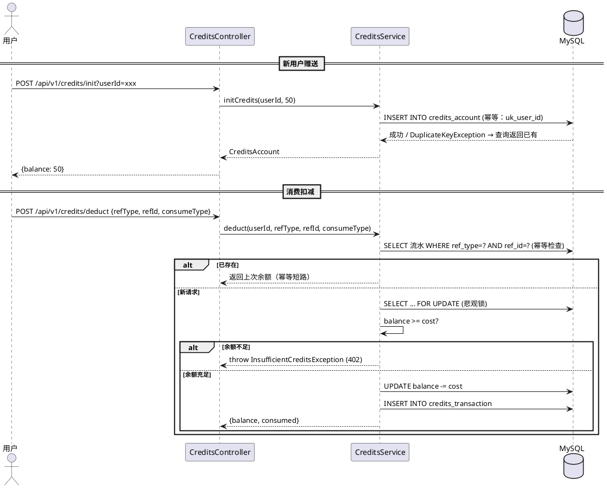

# farvis-credits — 业务现状

> **最后更新**：2026-06-19（迭代 2026-06-19_积分体系_v1.0 归档）
> **维护规则**：仅在迭代归档时更新，迭代进行中保持不变

---

## 1. 模块定位

积分体系模块。管理用户积分的赠送、充值、消费扣减和流水记录。积分是所有付费操作的统一计量单位。

---

## 2. 核心业务规则

| # | 规则 | 说明 |
|:-:|------|------|
| R1 | 新用户赠送 | 注册时赠送 50 Credits（幂等，uk_user_id 兜底） |
| R2 | 消费场景定价 | VIDEO=50C / AVATAR=100C / VOICE_CLONE=50C / VIDEO_HD=100C |
| R3 | 充值套餐 | starter ¥99/500C / pro ¥299/2000C（推荐）/ enterprise ¥999/10000C |
| R4 | 余额校验 | 消费前校验余额 ≥ 所需 Credits，不足返回 402 |
| R5 | 幂等保证 | ref_type + ref_id 唯一索引，重复请求返回上次结果不重复扣减 |
| R6 | 并发安全 | SELECT FOR UPDATE 悲观锁，防止并发扣减余额 |
| R7 | 流水记录 | 每笔 GIFT/RECHARGE/CONSUME 都记录到 credits_transaction 表 |
| R8 | 余额约束 | CHECK 约束保证 balance/total_recharged/total_consumed ≥ 0 |

---

## 3. 核心流程

---

## 4. 边界条件

| 场景 | 处理方式 |
|------|---------|
| 余额不足 | 返回 402 Payment Required，message 包含所需和当前余额 |
| 账户不存在（未 init） | 返回 404 Not Found |
| 重复扣减（相同 ref） | 幂等短路，返回上次余额，不重复扣减 |
| 重复赠送 | uk_user_id 唯一索引兜底，返回已有账户 |
| 并发扣减 | SELECT FOR UPDATE 行锁保证串行执行 |
| 流水查询时间范围过大 | 分页查询，默认 20 条/页，最大 100 条/页 |

---

## 5. 变更历史

| 迭代 | 日期 | 变更内容 |
|------|------|---------|
| 项目初始化 | 2026-06-19 | 模块文档创建 |
| 2026-06-19_测试迭代_v0.1 | 2026-06-19 | 新增 Credits 消耗查询 API |
| 2026-06-19_积分体系_v1.0 | 2026-06-19 | 完整实现：赠送/充值/扣减/余额查询/流水分页/套餐列表，含幂等+悲观锁+CHECK 约束 |
