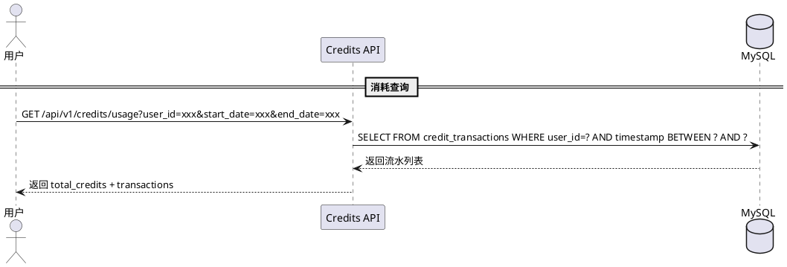

# farvis-credits — 业务现状

> **最后更新**：2026-06-19（迭代 2026-06-19_测试迭代_v0.1 归档）
> **维护规则**：仅在迭代归档时更新，迭代进行中保持不变

---

## 1. 模块定位

积分体系模块。管理用户积分的充值、消耗、流水记录。积分是所有付费操作的统一计量单位。

---

## 2. 核心业务规则

| # | 规则 | 说明 |
|:-:|------|------|
| R1 | 消耗场景 | 视频生成 50C / 数字分身创建 100C / 语音克隆 50C |
| R2 | 充值方式 | 套餐购买（¥99/399/999） |
| R3 | 免费试用 | 免费用户有初始 Credits 用于体验 |
| R4 | 流水记录 | 每笔充值/消耗都记录流水（credit_transactions 表） |
| R5 | 余额校验 | 操作前校验余额是否充足 |
| R6 | 消耗查询 | 支持按用户+时间范围查询消耗明细（GET /api/v1/credits/usage） |

---

## 3. 核心流程

---

## 4. 边界条件

| 场景 | 处理方式 |
|------|---------|
| 余额不足 | 返回 402，提示充值 |
| 查询时间范围过大 | 限制最大 90 天 |
| 无消耗记录 | 返回 total_credits=0 + 空 transactions 列表 |

---

## 5. 变更历史

| 迭代 | 日期 | 变更内容 |
|------|------|---------|
| 项目初始化 | 2026-06-19 | 模块文档创建 |
| 2026-06-19_测试迭代_v0.1 | 2026-06-19 | 新增 Credits 消耗查询 API |
