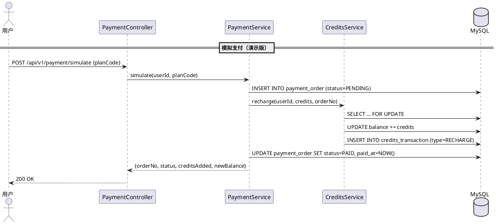

# farvis-payment — 业务现状

> **最后更新**：2026-06-19（迭代 2026-06-19_积分体系_v1.0 归档）
> **维护规则**：仅在迭代归档时更新，迭代进行中保持不变

---

## 1. 模块定位

支付模块。当前为演示版（模拟支付），处理套餐购买并充值积分。后续对接真实支付渠道时替换 simulate 接口。

---

## 2. 核心业务规则

| # | 规则 | 说明 |
|:-:|------|------|
| R1 | 套餐档位 | starter ¥99/500C / pro ¥299/2000C / enterprise ¥999/10000C |
| R2 | 事务合并 | 创建订单 → 充值 Credits → 更新订单状态在同一事务内完成 |
| R3 | 订单号生成 | PAY + yyyyMMddHHmmss + 4位随机数 |
| R4 | 状态流转 | PENDING → PAID / CANCELLED / FAILED |
| R5 | 模拟支付 | 当前版本无真实支付对接，调用即直接 PAID |

---

## 3. 核心流程

---

## 4. 边界条件

| 场景 | 处理方式 |
|------|---------|
| 无效套餐编码 | 返回 400 Bad Request |
| 重复支付（相同 orderNo） | 幂等，返回已有订单状态 |
| 充值失败 | 事务回滚，订单状态保持 PENDING |

---

## 5. 变更历史

| 迭代 | 日期 | 变更内容 |
|------|------|---------|
| 项目初始化 | 2026-06-19 | 模块文档创建 |
| 2026-06-19_积分体系_v1.0 | 2026-06-19 | 实现模拟支付：PaymentController + PaymentService，事务合并（创建订单→充值→状态更新），3 档套餐 |
