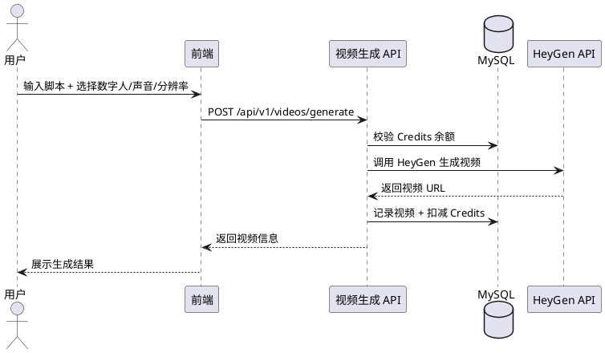

# farvis-video — 业务现状

> **最后更新**：2026-06-19（迭代 2026-06-19_测试迭代_v0.1 归档）
> **维护规则**：仅在迭代归档时更新，迭代进行中保持不变

---

## 1. 模块定位

视频生成核心模块。用户输入脚本 → 选择数字人和声音 → 调用 HeyGen API 合成口播视频。消耗 50 Credits/次。

---

## 2. 核心业务规则

| # | 规则 | 说明 |
|:-:|------|------|
| R1 | 生成消耗 | 每次视频生成消耗 50 Credits |
| R2 | 输出规格 | 1080P 高清输出（支持 720p/1080p 选择） |
| R3 | 默认选择 | 默认数字人：杨学瑞，默认声音：雷军演讲，默认分辨率：1080p |
| R4 | 状态管理 | 视频状态：生成中 / 已完成 / 失败 |
| R5 | 失败重试 | 生成失败时支持重试，不重复扣费 |
| R6 | 分辨率参数 | 请求体支持 resolution 字段（720p/1080p），向后兼容 |

---

## 3. 核心流程

---

## 4. 边界条件

| 场景 | 处理方式 |
|------|---------|
| Credits 不足 | 返回 402 Payment Required，提示充值 |
| HeyGen API 配额耗尽 | 降级处理，返回 503 Service Unavailable |
| 生成失败 | 不扣减 Credits，支持重试 |
| resolution 参数未传 | 使用默认值 1080p |

---

## 5. 变更历史

| 迭代 | 日期 | 变更内容 |
|------|------|---------|
| 项目初始化 | 2026-06-19 | 模块文档创建 |
| 2026-06-19_测试迭代_v0.1 | 2026-06-19 | 新增 resolution 参数支持（720p/1080p） |
