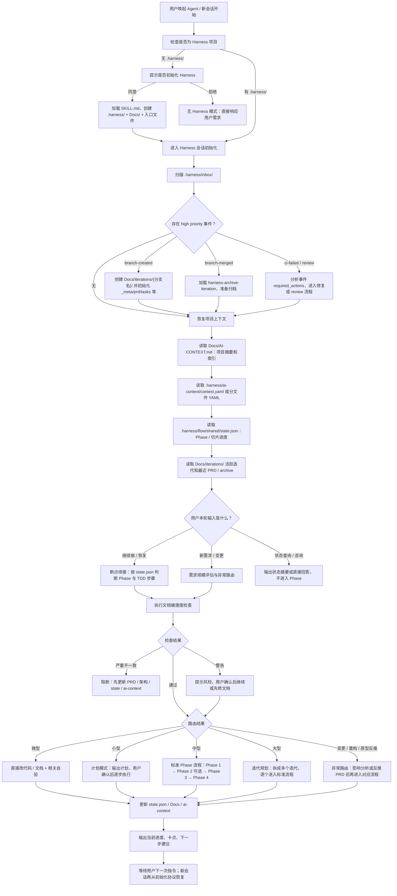

# Java AI Coding Harness

> 让 Claude Code / Codex 等 AI Coding Agent 能在 Java 项目中**自主、连续地完成开发任务**的协作基础设施。

---

## 0. 为什么存在

### 问题

我们大量使用 Claude Code、Codex 等 coding agent 做项目开发，但当前仍是**人工对话驱动**的模式——人反复给 Agent 下指令、等产出、验证、再下指令。效率极低，人被频繁打断。

### 目标

构建一套**人机协作的开发流程**：人定义目标和关键决策，Harness 通过流程 Skill 控制节奏和规范，Agent 负责实际执行。最终达到：

- **人尽可能少介入**，只在产品方向、架构选型、卡点排障时出现
- **Agent 端到端产出**验证通过、符合规范的代码
- **迭代式推进**，每个迭代从需求→开发→测试跑完一个完整闭环

### 当前阶段

**不做自动编排器。** 先用方法论指导人工编排，通过实践摸清每个环节的卡点和不确定性，让每个环节都跑顺，最后再做统一编排层。

### 执行主体

本仓库不是 CLI、后台服务或自动状态机。它是一套给 Claude Code / Codex / Qoder 等 Agent 阅读和执行的 **Agent Operating Manual**：包含流程说明、状态协议、上下文结构、工程模板和少量辅助脚本。

完整迭代的推进主体是 **Agent**：

1. Agent 读取 `Docs/`、`.harness/ai-context/`、`.harness/flow/` 和 `.harness/flow/shared/state.json`
2. Agent 根据当前状态判断下一步该进入哪个 Phase、是否需要人确认、是否可以继续自主推进
3. Agent 按流程执行开发、测试、修复、归档等动作
4. Agent 在执行过程中更新状态文件、迭代文档和 AI Context
5. 下次新会话再从这些状态文件恢复进度，继续往下跑

仓库里的脚本只承担局部辅助能力，例如 Git Hook 写入事件、环境自检、模板参数化；它们不负责消费所有事件，也不负责自动编排完整迭代。

| 能力 | 执行主体 |
|------|---------|
| 判断当前 Phase / 下一步动作 | Agent 读取状态和流程文档后判断 |
| 推进需求、设计、开发、测试、归档 | Agent 按 `.harness/flow/` 和 Skill 文档执行 |
| 更新 `state.json`、迭代文档、AI Context | Agent 执行后维护 |
| 处理 `.harness/inbox/` 事件 | Agent 启动或恢复上下文时扫描处理 |
| 写入 Git 事件、提交前测试、环境检查 | 脚本提供局部辅助 |
| 完整自动编排器 / 状态机 runner | 当前不提供 |

---

## 1. 人机协作边界

核心原则：**让 Agent 尽量自己往下跑，不要动不动停下来问人。**

### Agent 工作流程图



### 一个迭代的完整流程

```mermaid
flowchart TD
    A["迭代开始：用户定义目标或 Git 分支创建事件"] --> B["绑定迭代：分支名 = Docs/iterations/{迭代名}/"]
    B --> C["初始化迭代目录：_meta.yaml / prd.md / tech-design.md / tasks.md / ddl/api/review-notes"]
    C --> D["Phase 1：产品与原型"]

    D --> D1["识别产品形态，收集需求"]
    D1 --> D2["产品层决策树：Agent 自定 / 必问用户 / 暂定待确认"]
    D2 --> D3["输出 PRD 概要，用户确认"]
    D3 --> D4["按需生成轻量原型并自检"]
    D4 --> D5["写入 prd.md；提取 business-rules 和 error-catalog"]
    D5 --> E{"是否需要 Phase 2？"}

    E -->|多模块 / 新技术 / 数据模型变更 / 架构过时| F["Phase 2：架构设计与任务规划"]
    E -->|简单迭代 / 已有架构可复用 / 用户要求跳过| G["Phase 3 fallback：开发前做一次全局设计"]

    F --> F1["技术选型、模块划分、模块通信"]
    F1 --> F2["记录 ADR，更新 project-map / coding-rules"]
    F2 --> F3["拆粗粒度任务，确认依赖和执行顺序"]
    F3 --> F4["写入 tech-design.md 和 tasks.md"]
    F4 --> H["Phase 3：Spec 与开发"]
    G --> H

    H --> H1["读取 PRD、任务清单、ai-context 和 state.json"]
    H1 --> H2["任务拆切片：简单任务直接开始，复杂任务给用户快速确认"]
    H2 --> I["逐切片循环"]
    I --> I1["Spec 分析：技术决策树 A/B/C"]
    I1 --> I2["追加切片设计到 tech-design.md"]
    I2 --> I3["TDD 五步：编译/单测/切片/集成/重构"]
    I3 --> I4{"测试通过？"}
    I4 -->|通过| I5["更新 state.json；记录 DDL/API 变更；进入下一切片"]
    I4 -->|失败| I6["自修循环：分析日志 → 修复 → 重跑"]
    I6 --> I7{"连续失败 ≥ 3 次或根因不确定？"}
    I7 -->|否| I3
    I7 -->|是| I8["升级给用户判断方向，解决后继续"]
    I8 --> I3
    I5 --> I9{"所有任务和切片完成？"}
    I9 -->|否| I
    I9 -->|是| J["Phase 3 最终自验：全量回归 / 接口调通 / 页面检查"]

    J --> K["Phase 4：集成测试"]
    K --> K1["读取 state.json，确认 Phase 3 完成"]
    K1 --> K2["准备环境，执行 env-check / 启动依赖"]
    K2 --> K3["从 PRD、架构、error-catalog、business-rules 生成测试计划"]
    K3 --> K4["用户确认测试计划"]
    K4 --> K5["执行 E2E / 契约 / 数据一致性 / 观测验证"]
    K5 --> K6{"发现问题？"}
    K6 -->|Bug / 环境 / 数据| K7["Agent 修复或回到对应 Phase 3 切片后回归"]
    K7 --> K5
    K6 -->|设计问题| K8["升级给用户决策，必要时回到 Phase 2/3"]
    K8 --> K5
    K6 -->|无阻塞| K9["写入 review-notes.md，执行 ai-context 同步检查"]

    K9 --> L["迭代完成：state.json 与 _meta.yaml 标记 completed"]
    L --> M["人 review 最终产出，决定是否交付 / 合并"]
    M --> N["合并到 main 后 post-merge 写入 branch-merged 事件"]
    N --> O["Agent 读取 inbox，执行 harness-archive-iteration"]
    O --> O1["合并 DDL/API/业务/架构变更到 Docs/project/"]
    O1 --> O2["移动 Docs/iterations/{迭代名}/ 到 Docs/archive/{迭代名}/"]
    O2 --> P["执行 harness-sync-context：更新 Docs/AI-CONTEXT.md 和 .ai-context-sync.json"]
    P --> Q["迭代归档完成，等待下一个迭代或新会话恢复"]
```



### 人机分工表

| 环节 | 谁做 | 说明 |
|------|------|------|
| 定义迭代目标 | **人** | 产品决策，Agent 不能替 |
| 任务拆解 | **Agent 拆，人确认** | Agent 从需求拆出切片，人快速 review |
| 逐切片开发 | **Agent** | 读上下文、按模板、写代码、跑测试 |
| 测试验证 | **Agent** | 跑测试、看结果、通过就自动推进 |
| 测试失败修复 | **Agent 先自己修** | 分析日志 → 改代码 → 重跑 |
| 反复修不好 | **人介入** | 真正的卡点，需要人判断方向 |
| 集成验证 | **Agent** | 自动跑全量测试 + 输出报告 |
| 最终验收 | **人** | 看整体产出，决定是否交付 |

### 三个关键设计决策

1. **编排层暂不自动化** — 先用 Skill 指导人工编排，摸清卡点后再做编排器
2. **流程 Skill = 人的操作手册** — harness-dev-flow 不是让 Agent 自循环的引擎，而是指导人如何编排 Agent 的人机协作流程定义
3. **Agent 通过 `.harness/` 获得自主能力** — 上下文、模板、编码规则、测试基础设施，让 Agent 在每个环节有足够信息自主决策

---

## 2. 当前进度

静态基础设施层（v0.3.1）已完成：上下文 schema、代码模板、测试基础设施、Git hooks、Docker 环境。

流程层（v0.5.0）已完成：`harness-dev-flow` 已从大而全的操作手册拆成**渐进式发现入口**，通过 `discovery.md`、`protocols/`、`routes/`、`lifecycle/` 按需加载流程细节。

下一步是拿一个真实迭代跑一遍验证：观察 Agent 是否能按入口恢复上下文、正确路由、持续更新状态和文档，并记录真实卡点。

**➜ 完整改造路线见 [ROADMAP.md](ROADMAP.md)**

---

## 3. 这是什么

### 一句话

**让 AI Agent 能有效开发 Java 软件的基础设施层。**

### 不是什么

| Harness 是 | Harness 不是 |
|-----------|-------------|
| 可复用的工程模板和配置 | 特定项目的业务代码 |
| 结构化知识定义（YAML schema） | 自然语言 wiki 文档 |
| 标准化工具链配置 | CI/CD 流水线定义 |
| AI 可消费的上下文格式 | Prompt 模板集合 |
| Agent 可执行的操作说明书 | 自动编排器 / CLI / 后台服务 |

### 六层组成

```
┌─────────────────────────────────────────────────────────┐
│ A. 流程层 — 人怎么编排 Agent                                 │
│    迭代流程、人机分工、决策边界（在 Harness Skill 中）          │
│    ✅ harness-dev-flow Skill                             │
├─────────────────────────────────────────────────────────┤
│ B. 上下文层 — AI 知道什么                                  │
│    project-map / business-rules / error-catalog          │
│    ✅ core/ai-context/                                   │
├─────────────────────────────────────────────────────────┤
│ C. 反馈层 — AI 改完多久知道对不对                            │
│    增量编译 / 切片测试 / 集成测试 / 契约测试                   │
│    ✅ stacks/{stack}/devops/build.gradle.kts              │
│    ✅ stacks/{stack}/infra/slice/                         │
├─────────────────────────────────────────────────────────┤
│ D. 环境层 — AI 的代码在哪里跑                               │
│    Docker Compose / WireMock / Outbox 模式                │
│    ✅ stacks/{stack}/devops/docker-compose.yml            │
│    ✅ stacks/{stack}/infra/outbox/                        │
├─────────────────────────────────────────────────────────┤
│ E. 观测层 — AI 怎么定位问题                                 │
│    结构化日志 / 业务 Metrics / Trace / Error Catalog       │
│    ✅ stacks/{stack}/infra/observe/                       │
├─────────────────────────────────────────────────────────┤
│ F. 代码模式层 — AI 按什么模板写代码                           │
│    Controller / Service / Entity / DTO / Test 模板        │
│    ✅ stacks/{stack}/templates/                           │
└─────────────────────────────────────────────────────────┘
```

---

## 4. 仓库结构

```
harness/                          # 本仓库
│
├── README.md                     # 目标定义 + 人机协作边界
├── ROADMAP.md                    # 改造路线图（当前进度、下一步）
├── VERSION                       # 版本号
├── SKILL.md                      # Harness 初始化 Skill（Agent 执行）
│
├── core-design/                 # 核心设计文档（方向锚定）
│   ├── 01-document-management-and-agent-interaction.md
│   ├── 02-docs-directory-spec.md
│   ├── 03-systems-integration.md # 新旧体系整合规范
│   ├── templates/               # 文档模板（AI Context / 迭代 / 项目 / 归档）
│   └── schemas/                 # JSON Schema（inbox 事件）
│
├── Docs/                        # 文档管理体系（运行时）
│   ├── AI-CONTEXT.md            # Agent 工作记忆（摘要+索引）
│   ├── project/                 # 项目当前状态（归档时更新）
│   │   ├── architecture.md
│   │   ├── data-model.md
│   │   ├── api-contracts.md
│   │   └── modules/             # 按模块拆分的业务现状
│   ├── iterations/              # 活跃迭代（进行中）
│   └── archive/                 # 已归档迭代（只读）
│
├── flow/                        # 开发流程定义（渐进式发现 + Phase 1→4）
│   ├── skill.md                 # 渐进式发现入口（会话初始化 + 路由 + 按需加载）
│   ├── discovery.md             # 发现索引：什么场景读什么文件
│   ├── protocols/               # 横切协议（会话恢复、断点续接、inbox、文档健康度）
│   ├── routes/                  # 路由规则（需求规模、异常路由、Phase 路由）
│   ├── lifecycle/               # 生命周期（迭代模型、归档、AI Context 同步）
│   ├── phase-1-product-prototype/
│   ├── phase-2-architecture/
│   ├── phase-3-spec-dev/
│   ├── phase-4-integration-test/
│   └── shared/                  # 跨阶段共享（state 模板、TDD 五步）
│
├── core/                        # 框架无关的 Harness 原理
│   ├── principles/              # 五条方法论（必读）
│   ├── patterns/                # 通用设计模式（概念层）
│   ├── ai-context/              # 上下文结构定义（YAML schema）
│   └── devops/                  # 通用环境定义（占位）
│
├── stacks/                      # 框架特定实现（可插拔）
│   ├── spring-boot3-jpa/        # Spring Boot 3 + JPA + MySQL + Redis
│   └── ...                      # 未来：quarkus, micronaut, mybatis 等
│
├── .harness/                    # Harness 运行时基础设施
│   ├── skills/                  # Agent Skill（harness-java / sync / archive）
│   ├── hooks/git/               # Git hooks（含 post-checkout / post-merge）
│   ├── inbox/                   # 外部事件信箱（异步通道）
│   └── inbox-processed/         # 已处理事件存档
│
└── examples/                    # 填写示例（验证模板可用性）
    └── farvis-ai/               # 数字人视频平台（Spring Boot）
```

### core/ 与 stacks/ 的分工

```
core/principles/    → "要做什么"（与技术栈无关）
core/patterns/      → "怎么做——概念上"（Outbox 是什么，不写 JPA 代码）
stacks/{stack}/     → "具体代码怎么写"（JPA @Entity + @Transactional）
```

### 四层信息模型

```
Docs/AI-CONTEXT.md              → Agent 工作记忆（摘要+索引，< 2000 字）
Docs/project/                   → 项目当前状态（人类可读，归档时更新）
.harness/ai-context/*.yaml      → 结构化上下文（机器友好，各 Phase 追加）
Docs/iterations/ + archive/     → 迭代历史（集中存放，归档后只读）
```

Agent 初始化 Harness 时：
1. 读 `core/principles/` 理解五条方法论
2. 读 `core/ai-context/` 理解上下文结构
3. 按项目技术栈选 `stacks/{stack}/`
4. 复制对应模板到目标项目
5. 初始化 `Docs/` 目录结构

---

## 5. 如何使用

### 对 Agent 说一句话

```
「给这个项目初始化 Java Harness」
```

Agent 自动：
1. 检测你的技术栈（Spring Boot / Quarkus / ...）
2. 在项目根目录创建 `.harness/`，全部文件归入其中
3. 创建/更新 `AGENTS.md`（Qoder/Codex）和 `CLAUDE.md`（Claude Code），渐进披露 Harness 结构
4. 不修改 `src/` 或已有业务代码

### 初始化后，项目结构

```
your-project/
├── .harness/                  # Harness 全部文件
│   ├── skills/                # Skill 文件（Agent 运行时加载）
│   │   └── harness-java.md
│   ├── ai-context/            # 结构化上下文（请按项目填写）
│   ├── hooks/                 # Git + AI 工具 hooks
│   │   ├── git/                #   pre-commit / pre-push / commit-msg
│   │   ├── claude/             #   Claude Code hooks（占位）
│   │   ├── codex/              #   Codex hooks（占位）
│   │   └── qoder/              #   Qoder hooks（占位）
│   ├── devops/                # Docker Compose + 构建建议
│   ├── infra/                 # Slice / Outbox / Observe 代码
│   ├── templates/             # Agent 开发模板
│   ├── principles/            # 五条方法论
│   ├── patterns/              # 设计模式
│   └── flow/                  # 开发流程定义（渐进式发现 + Phase 1→4）
│       ├── skill.md           # 短入口：初始化 + 路由 + 按需加载
│       ├── discovery.md       # 发现索引
│       ├── protocols/         # 会话、断点、事件、文档健康度协议
│       ├── routes/            # 需求规模、异常路由、Phase 路由
│       ├── lifecycle/         # 迭代模型、归档、同步
│       ├── phase-1~4/         # 各阶段 flow.md + templates
│       └── shared/            # state 模板、TDD 五步
├── AGENTS.md                  # Qoder / Codex 入口
├── CLAUDE.md                  # Claude Code 入口
├── .claude/skills/            # Claude Code Skill 目录
│   └── harness-java.md → ../../.harness/skills/harness-java.md  (symlink)
├── .codex/skills/             # Codex Skill 目录
│   └── harness-java.md → ../../.harness/skills/harness-java.md  (symlink)
├── .agents/skills/            # AGENTS.md 兼容工具
│   └── harness-java.md → ../../.harness/skills/harness-java.md  (symlink)
├── .git/hooks/                # Git hooks（软链接到 .harness/hooks/git/）
│   ├── pre-commit → ../../.harness/hooks/git/pre-commit
│   ├── pre-push   → ../../.harness/hooks/git/pre-push
│   └── commit-msg → ../../.harness/hooks/git/commit-msg
└── src/                       # 你的业务代码（不被 Harness 修改）
```

### 随后，对 Agent 说「开始 Phase 1」

Agent 读 AGENTS.md → 发现 `.harness/ai-context/` → 加载结构化上下文 → 进入 Harness 四阶段开发流程。

---

## 6. 五条方法论速览

详见 `core/principles/`。

| # | 方法论 | 一句话 | 检查：你的项目满足吗？ |
|:--|--------|------|------|
| 1 | 快速反馈 | 改完一行 3s 内知道能不能编译 | 是否有增量编译 + 切片测试？ |
| 2 | 上下文契约 | AI 看得懂项目结构和规则 | project-map 和 business-rules 是否可被 AI 读取？ |
| 3 | 自动验证 | AI 输出的代码受机器校验 | 幂等/降级/乱序是否有自动化测试？ |
| 4 | 环境一致性 | 本地成功 ≠ 侥幸能跑 | 本地依赖是否容器化？外部 API 是否有模拟？ |
| 5 | 可观测性 | 出问题能快速归因 | 日志是否结构化？是否有业务 Metrics？ |

---

## 7. 与技术栈的关系

Harness **原理**与技术栈无关。Harness **实现**与技术栈有关。

```
你现在用 Spring Boot → 用 stacks/spring-boot3-jpa/
以后换 Quarkus      → 创建 stacks/quarkus-panache/，core/ 不动
项目用 MyBatis      → 创建 stacks/spring-boot3-mybatis/，复用 spring-boot3-jpa 的 devops/，只替换 templates/
```

---

## 8. 版本

当前版本：**v0.5.0**（Step 1 完成：流程对齐 + 文档管理体系 + 整合）

版本规则见 [ROADMAP.md](ROADMAP.md)。

---

## 9. 相关仓库

| 仓库 | 关系 |
|------|------|
| `harness-dev-flow` Skill | 渐进式发现入口——Agent 按需加载协议、路由和 Phase，推进迭代开发 |
| `harness-research` | Harness 研究文档和设计演进记录 |
