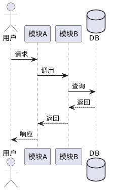

# 技术设计文档

> **迭代**：{YYYY-MM-DD_需求名称_版本}
> **作者**：{作者}
> **状态**：草稿 / 评审中 / 已确认

---

## 1. 设计概述

> 一段话说清楚技术方案的核心思路

{简要描述整体技术方案，包括核心架构决策和关键取舍}

---

## 2. 架构设计

> 如涉及架构变更，描述变更前后对比

### 2.1 模块关系

{描述本次迭代涉及的模块及其交互关系}

### 2.2 核心流程（PlantUML 时序图）

---

## 3. 数据模型设计

> 本次迭代涉及的表结构变更

### 3.1 新增表

| 表名 | 用途 | 核心字段 |
|------|------|---------|
| {table_name} | {用途} | {核心字段列表} |

### 3.2 变更表

| 表名 | 变更类型 | 字段 | 说明 |
|------|---------|------|------|
| {table_name} | 新增字段 / 修改字段 / 新增索引 | {field_name} | {说明} |

---

## 4. 接口设计

> 本次迭代涉及的接口变更

### 4.1 新增接口

| 方法 | 路径 | 说明 |
|------|------|------|
| POST | /api/v1/{resource} | {接口用途} |

### 4.2 修改接口

| 方法 | 路径 | 变更内容 |
|------|------|---------|
| {method} | {path} | {变更说明} |

---

## 5. 关键决策记录

| 决策点 | 方案 A | 方案 B | 选择 | 理由 |
|--------|--------|--------|------|------|
| {决策 1} | {方案描述} | {方案描述} | {A/B} | {选择理由} |

---

## 6. 风险与约束

| 风险/约束 | 影响 | 应对措施 |
|-----------|------|---------|
| {风险 1} | {影响描述} | {应对方案} |

---

## 7. 影响范围

> 本次变更会影响哪些已有模块/接口

| 影响对象 | 影响类型 | 说明 |
|---------|---------|------|
| {模块/接口} | 兼容 / 不兼容 | {影响描述} |
