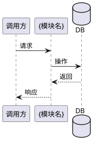

# {模块名称} — 业务现状

> **最后更新**：{YYYY-MM-DD}（迭代 {迭代名} 归档）
> **维护规则**：仅在迭代归档时更新，迭代进行中保持不变

---

## 1. 模块定位

> 一段话说清楚这个模块是干什么的

{模块职责、核心价值、与其他模块的关系}

---

## 2. 核心业务规则

| # | 规则 | 说明 |
|:-:|------|------|
| R1 | {规则名} | {详细描述} |
| R2 | {规则名} | {详细描述} |

---

## 3. 核心流程

> 关键业务流程的简要时序图

---

## 4. 边界条件

| 场景 | 处理方式 |
|------|---------|
| {边界场景 1} | {处理逻辑} |
| {边界场景 2} | {处理逻辑} |

---

## 5. 变更历史

| 迭代 | 日期 | 变更内容 |
|------|------|---------|
| {迭代名} | {YYYY-MM-DD} | {业务变更描述} |
