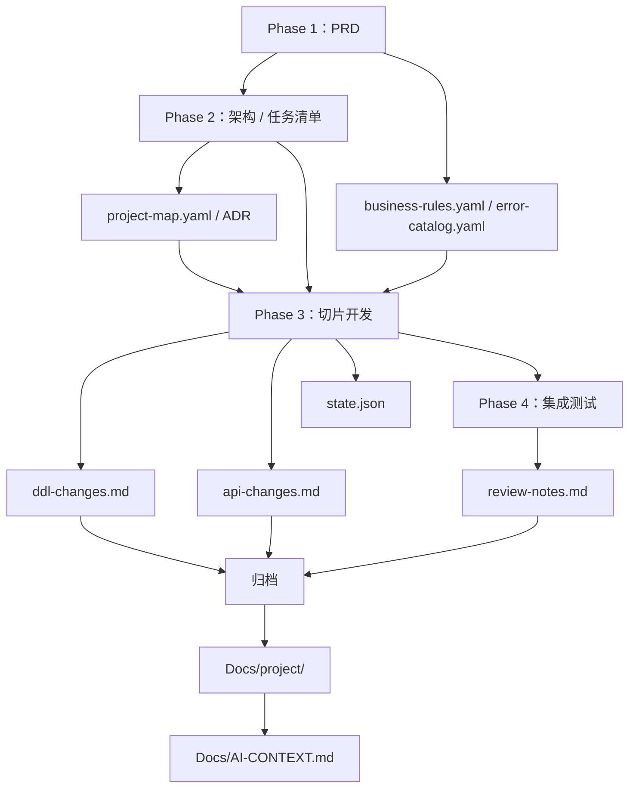

# 迭代模型与数据流

> **何时加载**：需要理解一个迭代如何创建、推进、完成和归档时。

---

## 迭代单位

开发以迭代为单位推进。

一个迭代是：

```
需求确认 → 架构设计（可选）→ 切片开发 → 集成验证 → 交付 → 归档
```

每个迭代对应一个目录：

```
Docs/iterations/{迭代名}/
├── _meta.yaml
├── prd.md
├── tech-design.md
├── tasks.md
├── ddl-changes.md
├── api-changes.md
└── review-notes.md
```

推荐一个 Git 分支绑定一个迭代，分支名等于迭代目录名。

---

## 状态模型

迭代状态：

```
in_progress → completed → archived
```

| 状态 | 目录位置 | 含义 |
|------|----------|------|
| `in_progress` | `Docs/iterations/` | 正在开发 |
| `completed` | `Docs/iterations/` | 开发和验证完成，待归档 |
| `archived` | `Docs/archive/` | 已合并到项目现状 |

---

## state.json 与 _meta.yaml

| 维度 | `state.json` | `_meta.yaml` |
|------|--------------|--------------|
| 位置 | `.harness/flow/shared/state.json` | `Docs/iterations/{迭代名}/_meta.yaml` |
| 职责 | 开发进度追踪 | 迭代元信息 |
| 粒度 | Phase / 切片 / TDD 步骤 | 迭代级 |
| 更新频率 | 每个切片和关键步骤 | 迭代创建、完成、归档 |
| 使用者 | 断点续接 | 归档和 AI Context 同步 |

---

## 跨阶段数据流



---

## 五层信息模型

| 层 | 位置 | 用途 |
|----|------|------|
| AI 工作记忆 | `Docs/AI-CONTEXT.md` | Agent 启动时快速了解全局 |
| 项目现状 | `Docs/project/` | 当前业务、架构、数据、接口的真相源 |
| 结构化上下文 | `.harness/ai-context/*.yaml` | Agent 做编码和路由决策 |
| 迭代历史 | `Docs/iterations/` + `Docs/archive/` | 过程记录和历史决策 |
| 异步事件通道 | `.harness/inbox/` + `.harness/inbox-processed/` | Git hook → Agent 事件通信 |

---

## 完成条件

一个迭代进入 completed 前，至少满足：

- Phase 3 所有切片 completed
- Phase 4 核心测试通过或不可修复项已记录
- `review-notes.md` 已写入测试和交付结论
- DDL/API 变更已记录
- `state.json` 已更新
- `_meta.yaml` 状态已更新为 `completed`

completed 不等于 archived。归档要等分支合并或用户明确触发。
