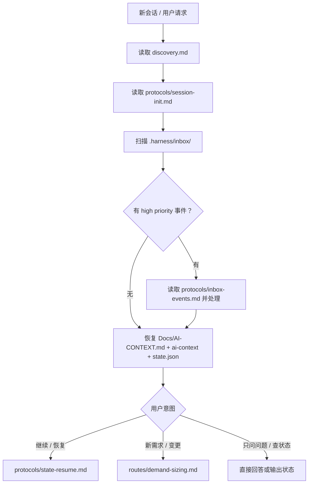

# Harness Dev Flow

这是 Harness 开发流程的**渐进式发现入口**。它不承载完整手册，只负责让 Agent 找到当前任务需要读的下一份材料。

完整迭代的推进主体是 Agent：

1. Agent 读取状态和上下文
2. Agent 判断当前路由
3. Agent 按需加载协议、路由或 Phase 文件
4. Agent 执行开发、测试、修复和文档更新
5. Agent 更新 `state.json`、迭代文档和 AI Context，供下次会话恢复

本仓库不提供完整自动编排器、后台服务或状态机 runner。脚本只提供局部辅助，例如 Git Hook 事件写入、环境自检、模板参数化。

---

## 必读原则

1. **先恢复上下文，再响应用户。**
2. **先路由，再加载细节。** 不要一上来读取 Phase 1~4 全量文档。
3. **读到足够就执行。** 只有命中阻断条件才停下问人。
4. **每次推进都维护状态。** `state.json`、迭代文档、ai-context 不能和实际进度脱节。
5. **新体系路径以 `Docs/` 为准。** 旧路径按 `core-design/03-systems-integration.md` 映射。

---

## 最小启动流程

每个新会话按以下顺序执行：



最小启动集：

| 顺序 | 文件 | 用途 |
|------|------|------|
| 1 | `discovery.md` | 渐进式发现索引 |
| 2 | `protocols/session-init.md` | 会话初始化和上下文恢复 |
| 3 | `protocols/inbox-events.md` | 处理外部事件 |
| 4 | `Docs/AI-CONTEXT.md` | 项目摘要和索引 |
| 5 | `.harness/flow/shared/state.json` | 当前 Phase / 切片 / TDD 进度 |

---

## 路由总表

| 场景 | 先加载 | 后续加载 |
|------|--------|----------|
| 新会话 | `protocols/session-init.md` | 视用户输入继续 |
| inbox 有事件 | `protocols/inbox-events.md` | `lifecycle/archive.md` / 当前 Phase |
| 用户说“继续” | `protocols/state-resume.md` | 当前 Phase 的 `flow.md` |
| 用户提出新需求 | `routes/demand-sizing.md` | `routes/phase-routing.md` 或计划模式 |
| 微型变更 | `routes/demand-sizing.md` | 直接执行，不进 Phase |
| 小型需求 | `routes/demand-sizing.md` | 计划模式，确认后执行 |
| 中型需求 | `routes/phase-routing.md` | Phase 1 → Phase 2 可选 → Phase 3 → Phase 4 |
| 大型需求 | `routes/demand-sizing.md` | 迭代规划后逐个进入标准流程 |
| 原型 / 截图 / 竞品 | `routes/exception-routing.md` | 反推 PRD 后进 Phase |
| 修改已有功能 | `routes/exception-routing.md` | 影响分析后按规模路由 |
| 技术重构 | `routes/exception-routing.md` | 重构计划 + 分切片执行 |
| 技术咨询 | `routes/exception-routing.md#non-development` | 直接回答 |
| Phase 启动前 | `protocols/doc-health-check.md` | 对应 Phase |
| Phase 1 | `phase-1-product-prototype/flow.md` | Phase 2 或 Phase 3 |
| Phase 2 | `phase-2-architecture/flow.md` | Phase 3 |
| Phase 3 | `phase-3-spec-dev/flow.md` | `.harness/skills/harness-java.md` |
| Phase 4 | `phase-4-integration-test/flow.md` | 归档或交付 |
| 迭代归档 | `lifecycle/archive.md` | `.harness/skills/harness-archive-iteration.md` |
| AI Context 同步 | `lifecycle/sync-context.md` | `.harness/skills/harness-sync-context.md` |

---

## Phase 简表

| Phase | 核心问题 | 入口文件 | 主要产出 |
|-------|----------|----------|----------|
| Phase 1 | 做什么？ | `phase-1-product-prototype/flow.md` | `Docs/iterations/{迭代名}/prd.md`，业务规则，错误码 |
| Phase 2 | 怎么做？ | `phase-2-architecture/flow.md` | `tech-design.md`，`tasks.md`，project-map，ADR |
| Phase 3 | 做出来 | `phase-3-spec-dev/flow.md` | 代码、测试、切片设计、DDL/API 变更、state 更新 |
| Phase 4 | 做对了吗？ | `phase-4-integration-test/flow.md` | 集成测试报告、review-notes、ai-context 同步检查 |

Phase 2 是可选的。判断规则见 `routes/phase-routing.md`。

---

## 文档路径规范

所有迭代产出集中写入：

```
Docs/iterations/{迭代名}/
```

标准文件：

| 文件 | 用途 |
|------|------|
| `_meta.yaml` | 迭代元信息 |
| `prd.md` | 产品需求 |
| `tech-design.md` | 架构设计 + 切片设计 |
| `tasks.md` | 任务清单和状态 |
| `ddl-changes.md` | DDL 变更 |
| `api-changes.md` | API 变更 |
| `review-notes.md` | 评审记录、测试报告、复盘 |

项目现状只在归档时更新：

```
Docs/project/
Docs/archive/
Docs/AI-CONTEXT.md
```

---

## 状态维护

每个阶段和切片推进时，必须更新：

```
.harness/flow/shared/state.json
```

状态职责：

- 当前迭代
- Phase 状态
- 当前切片
- TDD 步骤
- 自修次数
- 升级状态
- 交付指标

详细规则见 `protocols/state-resume.md` 和 `lifecycle/iteration-model.md`。

---

## 人机边界

默认让 Agent 自主推进。只有以下情况必须问人：

- 产品方向或交付范围需要决策
- 业务规则、合规、计费、权限等需要人定
- 架构选型没有上下文依据
- 同一问题自修 3 次仍失败
- 设计问题阻塞交付
- 最终验收

详细规则见 `protocols/human-ai-boundary.md`。

---

## 归档与同步

迭代 completed 后不等于 archived。

归档触发：

- 分支合并到 main 后，Git Hook 写入 `branch-merged` 事件
- 用户手动要求归档

归档加载：

1. `protocols/inbox-events.md`
2. `lifecycle/archive.md`
3. `.harness/skills/harness-archive-iteration.md`
4. `lifecycle/sync-context.md`
5. `.harness/skills/harness-sync-context.md`

---

## 参考文件

- `discovery.md`：渐进式发现索引
- `protocols/session-init.md`：会话初始化
- `protocols/state-resume.md`：断点续接
- `protocols/inbox-events.md`：事件信箱
- `protocols/doc-health-check.md`：文档健康度检查
- `routes/demand-sizing.md`：需求规模评估
- `routes/exception-routing.md`：异常路由
- `routes/phase-routing.md`：Phase 路由
- `lifecycle/iteration-model.md`：迭代模型与数据流
- `lifecycle/archive.md`：归档入口
- `lifecycle/sync-context.md`：AI Context 同步入口
- `references/agent-tips.md`：执行技巧
- `references/human-ai-boundary.md`：人机边界历史设计
